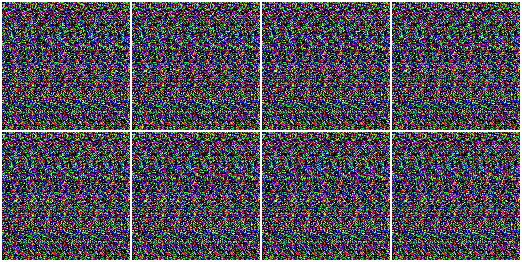

# Evaluating Image Representations for Video Prediction

A comprehensive implementation of video prediction models using Hybrid Transformer-based and CNN architectures for both **holistic** and **object-centric** scene representations. This project explores different approaches to learning and predicting future video frames on the MOVi-C dataset.

<p align="center">
  
</p>

## 📋 Table of Contents

- [Overview](#-overview)
- [Features](#-features)
- [Project Structure](#-project-structure)
- [Architecture](#️-architecture)
- [Dataset](#-dataset)
- [Usage](#-usage)
- [Experiments](#-experiments)
- [Model Checkpoints](#-model-checkpoints)
- [Configuration](#️-configuration)
- [Results](#-results)
- [Citation](#-citation)

## 🎯 Overview

This project implements a two-stage video prediction pipeline:

1. **Stage 1 - Autoencoder Training**: Learn compressed representations of video frames
2. **Stage 2 - Predictor Training**: Predict future frame representations in latent space

The framework supports two distinct scene representation approaches:
- **Holistic Representation**: Treats the entire scene as a unified entity
- **Object-Centric (OC) Representation**: Decomposes scenes into individual objects using masks/bounding boxes

## ✨ Features

- 🔄 **Two-Stage Training Pipeline**: Separate autoencoder and predictor training phases
- 🎭 **Dual Scene Representations**: Support for both holistic and object-centric approaches
- 🧠 **Transformer-Based Architecture**: Modern attention-based encoders and decoders
- 🎯 **Flexible Configuration**: Easy-to-modify configuration system
- 📊 **Comprehensive Logging**: TensorBoard integration with visualization support
- ⚡ **Mixed Precision Training**: Efficient GPU utilization with AMP support
- 🔍 **Early Stopping & Scheduling**: Automatic training optimization
- 💾 **Checkpoint Management**: Automatic model saving and loading


## 📁 Project Structure

```
CourseProject_2/
├── src/
│   ├── base/                    # Base classes
│   │   ├── baseTrainer.py       # Base trainer implementation
│   │   └── baseTransformer.py   # Base transformer blocks
│   ├── datalib/                 # Data loading and processing
│   │   ├── MoviC.py            # MOVi-C dataset class
│   │   ├── load_data.py        # Data loading utilities
│   │   └── transforms.py        # Data augmentation
│   ├── model/                   # Model architectures
│   │   ├── ocvp.py             # Main model definitions (TransformerAutoEncoder, TransformerPredictor, OCVP)
│   │   ├── holistic_encoder.py # Holistic encoder (patch-based)
│   │   ├── holistic_decoder.py # Holistic decoder
│   │   ├── holistic_predictor.py # Holistic predictor
│   │   ├── oc_encoder.py       # Object-centric encoder (CNN + Transformer)
│   │   ├── oc_decoder.py       # Object-centric decoder (Transformer + CNN)
│   │   ├── oc_predictor.py     # Object-centric predictor
│   │   ├── predictor_wrapper.py # Autoregressive wrapper with sliding window
│   │   └── model_utils.py      # Model utilities (TransformerBlock, Patchifier, etc.)
│   ├── utils/                   # Utility functions
│   │   ├── logger.py           # Logging utilities
│   │   ├── metrics.py          # Evaluation metrics
│   │   ├── utils.py            # General utilities
│   │   └── visualization.py    # Visualization tools
│   ├── experiments/             # Experiment outputs
│   │   └── [experiment_name]/
│   │       ├── checkpoints/    # Model checkpoints
│   │       ├── config/         # Experiment config
│   │       └── tboard_logs/    # TensorBoard logs
│   ├── CONFIG.py               # Global configuration
│   ├── trainer.py              # Training entry point
│   └── ocvp.ipynb             # Analysis notebook
├── docs/                       # Documentation and reports
├── requirements.txt            # Python dependencies
└── README.md                   # This file
```

### Why Transformer + CNN Hybrid?

The object-centric model uses a **hybrid Transformer + CNN architecture** for optimal performance:

**CNN Advantages:**
- ✅ **Inductive Bias**: Built-in understanding of spatial locality and translation invariance
- ✅ **Efficient Downsampling**: Reduces 64×64 images to compact 256D vectors
- ✅ **Parameter Efficiency**: Fewer parameters than fully linear projections
- ✅ **Better Image Reconstruction**: ConvTranspose layers naturally upsample spatial features

**Transformer Advantages:**
- ✅ **Temporal Modeling**: Captures long-range dependencies across time
- ✅ **Object Relationships**: Models interactions between multiple objects
- ✅ **Attention Mechanism**: Learns which objects/features are important
- ✅ **Flexible Context**: Handles variable number of objects and temporal sequences

**Combined Benefits:**
- 🎯 CNNs handle spatial features (what objects look like)
- 🎯 Transformers handle temporal dynamics (how objects move and interact)
- 🎯 Best of both worlds: local spatial structure + global temporal reasoning

### Key Components

1. **Encoder** (`HolisticEncoder` / `ObjectCentricEncoder`)
   - **Holistic**: Patchifies input images (16×16 patches) → Linear projection → Transformer
   - **Object-Centric**: CNN encoder + Transformer hybrid architecture
     - **CNN Feature Extraction**: 3-layer ConvNet downsampler
       - Conv2d(3→64): 64×64 → 32×32
       - Conv2d(64→128): 32×32 → 16×16
       - Conv2d(128→256): 16×16 → 8×8
       - Linear: Flatten → 256D embedding
     - Extracts per-object features from masks/bboxes (up to 11 objects)
     - Transformer processes object tokens across time
   - Configurable depth (12 layers default)
   - Embedding dimension: 256
   - Multi-head attention (8 heads)
   - MLP size: 1024

2. **Decoder** (`HolisticDecoder` / `ObjectCentricDecoder`)
   - **Holistic**: Transformer → Linear projection → Unpatchify to image
   - **Object-Centric**: Transformer + CNN hybrid architecture
     - Transformer processes latent object representations
     - **CNN Upsampling Decoder**: 3-layer ConvTranspose
       - Linear: 192D → 128×8×8 feature map
       - ConvTranspose2d(128→64): 8×8 → 16×16
       - ConvTranspose2d(64→32): 16×16 → 32×32
       - ConvTranspose2d(32→3): 32×32 → 64×64 RGB
       - Tanh activation for [-1, 1] output range
     - Combines per-object frames back to full scene
   - Configurable depth (8 layers default)
   - Embedding dimension: 192
   - Mixed loss: MSE (0.8) + L1 (0.2)

3. **Predictor** (`HolisticTransformerPredictor` / `ObjectCentricTransformerPredictor`)
   - Predicts future latent representations autoregressively
   - Transformer-based temporal modeling
   - Configurable depth (8 layers default)
   - Embedding dimension: 192
   - Optional residual connections

4. **Predictor Wrapper** (`PredictorWrapper`)
   - **Autoregressive Prediction**: Iteratively predicts future frames
   - **Sliding Window Mechanism**: Maintains a buffer of size 5
     - Concatenates new predictions to input buffer
     - Drops oldest frames when buffer exceeds window size
   - **Training Strategy**:
     - Random temporal slicing for data augmentation
     - Per-step loss computation with temporal consistency
   - **Advanced Loss Function**:
     - MSE loss (0.6): Overall structure
     - L1 loss (0.2): Sharpness and sparsity
     - Cosine similarity loss (0.2): Feature alignment
   - Generates 5 future frame predictions per forward pass


## 🏗️ Architecture

### Overall Pipeline

```
Input Video Frames → Encoder → Latent Representation → Predictor → Future Latent → Decoder → Predicted Frames
```

### Detailed Architecture: Object-Centric Model (Transformer + CNN)

```
┌─────────────────────────────────────────────────────────────────────────────┐
│                          OBJECT-CENTRIC ENCODER                             │
├─────────────────────────────────────────────────────────────────────────────┤
│ Input: Video [B, T, 3, 64, 64] + Masks [B, T, 64, 64]                       │
│   ↓                                                                         │
│ Object Extraction (11 objects max)                                          │
│   → Object Frames: [B, T, 11, 3, 64, 64]                                    │
│   ↓                                                                         │
│ CNN Feature Extractor (Per Object):                                         │
│   • Conv2d(3→64, k=4, s=2) + BatchNorm + ReLU    [64x64 → 32x32]            │
│   • Conv2d(64→128, k=4, s=2) + BatchNorm + ReLU  [32x32 → 16x16]            │
│   • Conv2d(128→256, k=4, s=2) + BatchNorm + ReLU [16x16 → 8x8]              │
│   • Flatten + Linear(256·8·8 → 256)                                         │
│   → Object Tokens: [B, T, 11, 256]                                          │
│   ↓                                                                         │
│ Transformer Encoder (12 layers):                                            │
│   • Positional Encoding                                                     │
│   • Multi-Head Attention (8 heads, dim=128)                                 │
│   • MLP (dim=1024)                                                          │
│   • Layer Normalization                                                     │
│   → Latent: [B, T, 11, 256]                                                 │ 
└─────────────────────────────────────────────────────────────────────────────┘
┌─────────────────────────────────────────────────────────────────────────────┐
│                            PREDICTOR + WRAPPER                              │
├─────────────────────────────────────────────────────────────────────────────┤
│ Input Latent: [B, T=24, 11, 256]                                            │
│   ↓                                                                         │
│ PredictorWrapper (Autoregressive):                                          │
│   • Random temporal slice (5 frames)                                        │
│   • Sliding window buffer (size=5)                                          │
│   ↓                                                                         │
│ Transformer Predictor (8 layers):                                           │
│   • Linear(256 → 192)                                                       │
│   • Transformer blocks (depth=8)                                            │
│   • Linear(192 → 256)                                                       │
│   • Optional residual connections                                           │
│   ↓                                                                         │
│ Autoregressive Loop (5 predictions):                                        │
│   For t in 1..5:                                                            │
│     • Predict next frame                                                    │
│     • Append to buffer, shift window                                        │
│     • Compute loss (MSE + L1 + Cosine)                                      │
│   → Future Latent: [B, 5, 11, 256]                                          │ 
└─────────────────────────────────────────────────────────────────────────────┘
┌─────────────────────────────────────────────────────────────────────────────┐
│                          OBJECT-CENTRIC DECODER                             │
├─────────────────────────────────────────────────────────────────────────────┤
│ Input Latent: [B, T, 11, 256]                                               │
│   ↓                                                                         │
│ Transformer Decoder (8 layers):                                             │
│   • Linear(256 → 192)                                                       │
│   • Positional Encoding                                                     │
│   • Transformer blocks (depth=8)                                            │
│   • Layer Normalization                                                     │
│   → [B, T, 11, 192]                                                         │
│   ↓                                                                         │
│ CNN Upsampling Decoder (Per Object):                                        │
│   • Linear(192 → 128·8·8) + Reshape to [128, 8, 8]                          │
│   • ConvTranspose2d(128→64, k=4, s=2) + BatchNorm + ReLU [8x8 → 16x16]      │
│   • ConvTranspose2d(64→32, k=4, s=2) + BatchNorm + ReLU [16x16 → 32x32]     │
│   • ConvTranspose2d(32→3, k=4, s=2) + Tanh        [32x32 → 64x64]           │
│   → Per-Object Frames: [B, T, 11, 3, 64, 64]                                │
│   ↓                                                                         │
│ Object Composition:                                                         │
│   • Sum all object frames: Σ(objects)                                       │
│   • Normalize: (x + 1) / 2  (from [-1,1] to [0,1])                          │
│   • Clamp to [0, 1]                                                         │
│   → Reconstructed Video: [B, T, 3, 64, 64]                                  │
└─────────────────────────────────────────────────────────────────────────────┘
```

### Setup

1. **Clone the repository**:
```bash
git clone <repository-url>
cd CourseProject_2
```

2. **Create and activate virtual environment**:
```bash
python -m venv venv
source venv/bin/activate  # On Linux/Mac
# or
venv\Scripts\activate  # On Windows
```

3. **Install dependencies**:
```bash
pip install -r requirements.txt
```

## 📦 Dataset

This project uses the **MOVi-C dataset** (Multi-Object Video Dataset).

### Dataset Setup

1. Download MOVi-C dataset from the official source
2. Extract to your preferred location
3. Update the dataset path in `src/CONFIG.py`:

```python
config = {
    'data': {
        'dataset_path': '/path/to/movi_c/',
        ...
    }
}
```

### Dataset Structure

The MOVi-C dataset should have the following structure:
```
movi_c/
├── train/
├── validation/
└── test/
```

## 💻 Usage

### Training Autoencoder

Train the autoencoder with holistic representation:

```bash
cd src
python trainer.py --ae --scene_rep holistic
```

Train with object-centric representation:

```bash
python trainer.py --ae --scene_rep oc
```

### Training Predictor

After training the autoencoder, train the predictor:

```bash
python trainer.py --predictor --scene_rep holistic \
    --ackpt experiments/01_Holistic_AE_XL/checkpoints/best_01_Holistic_AE_XL.pth
```

For object-centric:

```bash
python trainer.py --predictor --scene_rep oc \
    --ackpt experiments/01_OC_AE_XL_64_Full_CNN/checkpoints/best_01_OC_AE_XL_64_Full_CNN.pth
```

### Inference

Run end-to-end video prediction:

```bash
python trainer.py --inference --scene_rep holistic \
    --ackpt path/to/autoencoder.pth \
    --pckpt path/to/predictor.pth
```

### Command-Line Arguments

| Argument | Short | Description |
|----------|-------|-------------|
| `--ae` | `-a` | Enable autoencoder training mode |
| `--predictor` | `-p` | Enable predictor training mode |
| `--inference` | `-i` | Enable end-to-end inference mode |
| `--ackpt` | `-ac` | Path to pretrained autoencoder checkpoint |
| `--pckpt` | `-pc` | Path to pretrained predictor checkpoint |
| `--scene_rep` | `-s` | Scene representation type: `holistic` or `oc` |


## 🔬 Experiments

The project includes several experimental configurations:

### Autoencoder Experiments

1. **Holistic Autoencoders**:
   - `01_Holistic_AE_Base`: Baseline holistic autoencoder
   - `02_Holistic_AE_XL`: Extra-large holistic autoencoder

2. **Object-Centric Autoencoders**:
   - `01_OC_AE_XL_64_Full_CNN`: Full CNN-based OC autoencoder
   - `01_OC_AE_XL_64_Mixed_CNN_Decoder_Linear_ENCODER`: Mixed architecture
   - Various linear and advanced configurations

### Predictor Experiments

1. **Holistic Predictors**:
   - `02_Holistic_Predictor_XL`: Standard predictor
   - `03_Holistic_Predictor_XL`: Improved version
   - `05_Holistic_Predictor_XL_NoResidual`: Without residual connections

2. **Object-Centric Predictors**:
   - `01_OC_Predictor_XL`: Standard OC predictor

### Experiment Outputs

Each experiment generates:
- **Checkpoints**: Best and periodic model saves
- **TensorBoard Logs**: Training curves, visualizations
- **Configuration Snapshots**: Reproducible experiment configs

## 💾 Model Checkpoints

Pre-trained model checkpoints are available for download:

🔗 [Download Model Checkpoints](https://drive.google.com/drive/folders/1cS1CwnZP8BhBA2fGcYH9fJmT7s9OIALP?usp=drive_link)

### Available Checkpoints

- Holistic Autoencoder (Base & XL)
- Object-Centric Autoencoder (Various configurations)
- Holistic Predictor (Multiple versions)
- Object-Centric Predictor

## ⚙️ Configuration

The main configuration file is `src/CONFIG.py`. Key parameters:

### Data Configuration

```python
'data': {
    'dataset_path': '/path/to/movi_c/',
    'batch_size': 32,
    'patch_size': 16,
    'max_objects': 11,
    'num_workers': 8,
    'image_height': 64,
    'image_width': 64,
}
```

### Training Configuration

```python
'training': {
    'num_epochs': 300,
    'warmup_epochs': 15,
    'early_stopping_patience': 15,
    'model_name': '01_OC_AE_XL_64_Full_CNN',
    'lr': 4e-4,
    'save_frequency': 25,
    'use_scheduler': True,
    'use_early_stopping': True,
    'use_transforms': False,
    'use_amp': True,  # Mixed precision training
}
```

### Model Configuration

```python
'vit_cfg': {
    'encoder_embed_dim': 256,
    'decoder_embed_dim': 192,
    'num_heads': 8,
    'mlp_size': 1024,
    'encoder_depth': 12,
    'decoder_depth': 8,
    'predictor_depth': 8,
    'num_preds': 5,
    'predictor_window_size': 5,
    'use_masks': True,
    'use_bboxes': False,
    'residual': True,
}
```

## 📊 Results

### Reconstruction Quality

The models achieve high-quality video frame reconstruction:

- **Holistic Models**: Capture global scene structure effectively
- **Object-Centric Models**: Better at preserving individual object details

### Visualization

View results in the Jupyter notebook:

```bash
cd src
jupyter lab ocvp.ipynb
```

The notebook includes:
- Training/validation loss curves
- Reconstruction visualizations
- Prediction quality analysis
- Comparison between holistic and object-centric approaches

### TensorBoard

Monitor training progress:

```bash
tensorboard --logdir src/experiments/[experiment_name]/tboard_logs
```

## 🎓 Citation

If you use this code in your research, please cite:

```bibtex
@misc{video_prediction_ocvp,
  title={Evaluating Image Representations for Video Prediction},
  author={Your Name},
  year={2025},
  howpublished={\url{https://github.com/your-repo}}
}
```

---

**Note**: This is a course project Video Prediction with Object Representations. See the `docs/` folder for project reports and lab notebook examples.
